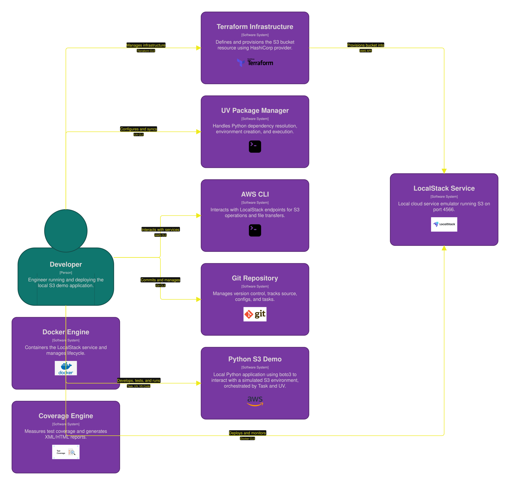
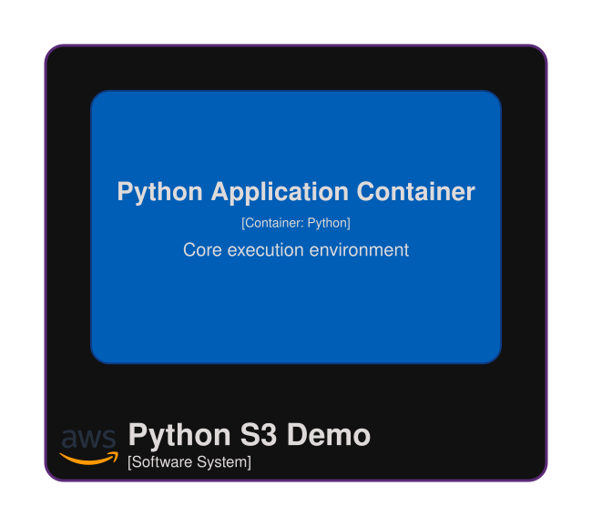
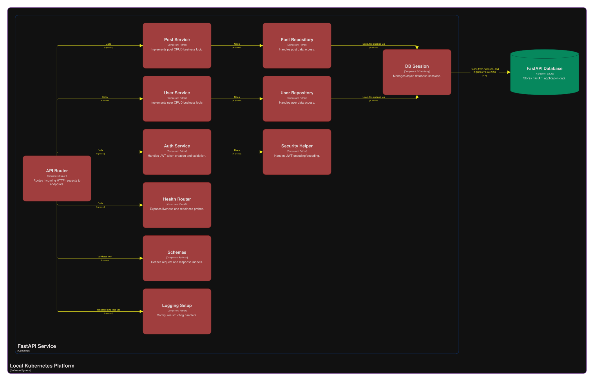
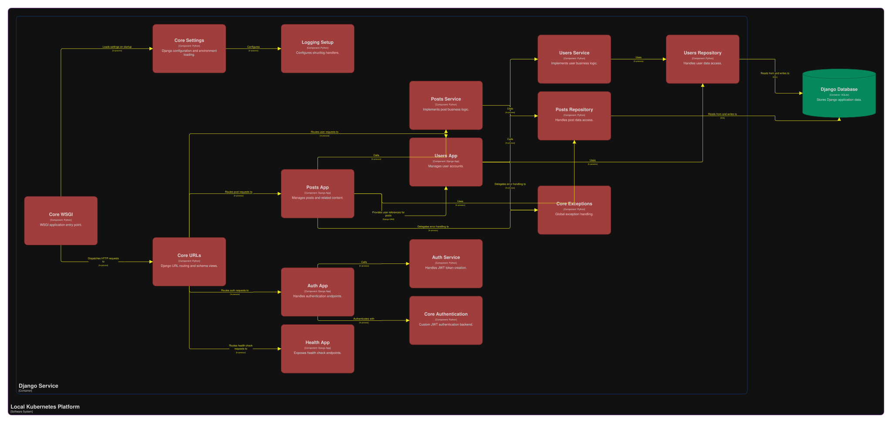

# C4 Diagrams Project

```commandline
clear ; 

docker system df ; 
docker compose down -v --remove-orphans ; 
docker stop $(docker ps -a -q) ; 
docker rm -f $(docker ps -a -q) ; 
docker system prune --volumes -a -f ; 
docker volume rm -f $(docker volume ls -q) ; 
docker system df ; 

git reset --hard HEAD ; 
git clean -x -d -f ; 

docker run -it --rm -d -p 8081:8080 -v ${PWD}/c4-diagrams:/usr/local/structurizr -e STRUCTURIZR_WORKSPACE_FILENAME=ml_platform_architecture structurizr/structurizr local

Start-Sleep -Seconds 10 ; 
Start-Process "http://127.0.0.1:8081" ; 
```


<table align="center">
  <tr>
    <td align="center">
        
      </a>
    </td>
    <td></td>
    <td align="center">
        
      </a>
    </td>
  </tr>
    <tr>
    <td align="center">
        
      </a>
    </td>
    <td></td>
    <td align="center">
        
      </a>
    </td>
</table>
